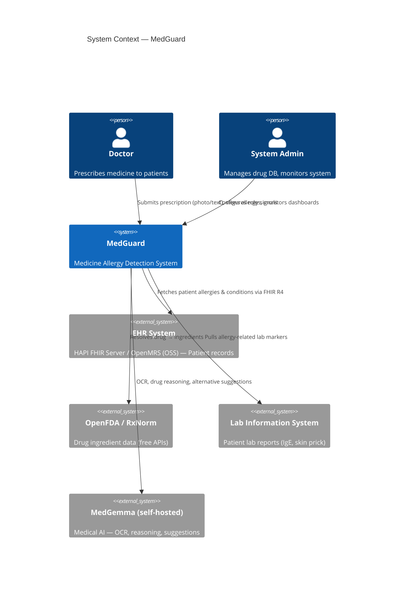
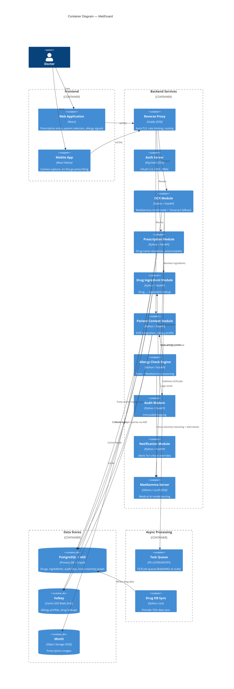
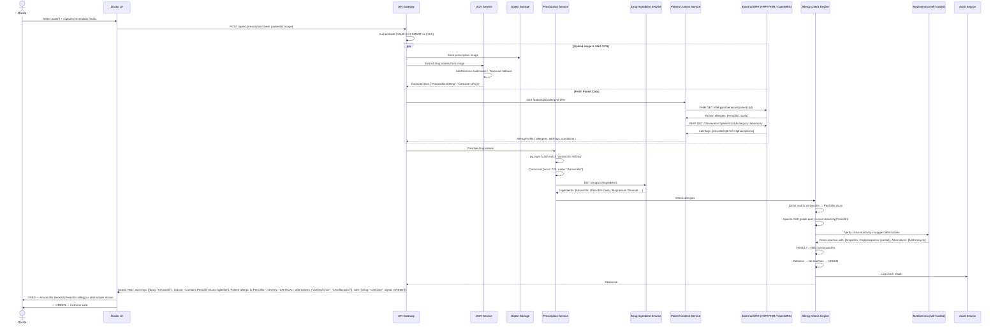
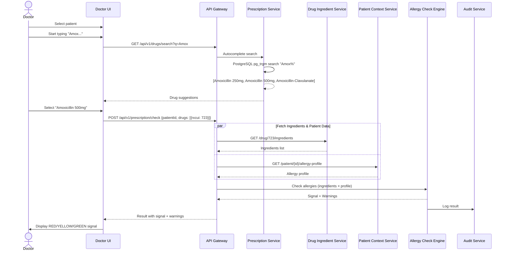
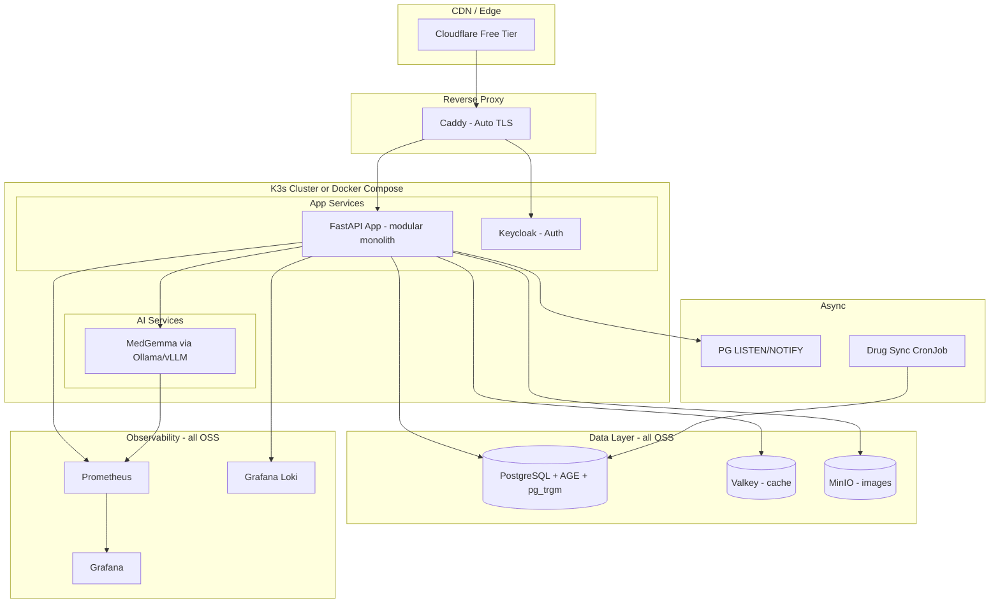
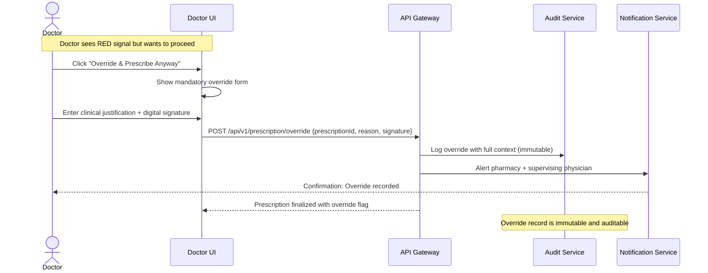

# MedGuard — Architecture Diagrams

## 1. System Context Diagram (C4 Level 1)

---

## 2. Container Diagram (C4 Level 2)

---

## 3. Sequence Diagram — Prescription Check (Photo Flow)

---

## 4. Sequence Diagram — Manual Entry Flow

---

## 5. Deployment Architecture

---

## 6. Doctor Override Flow

